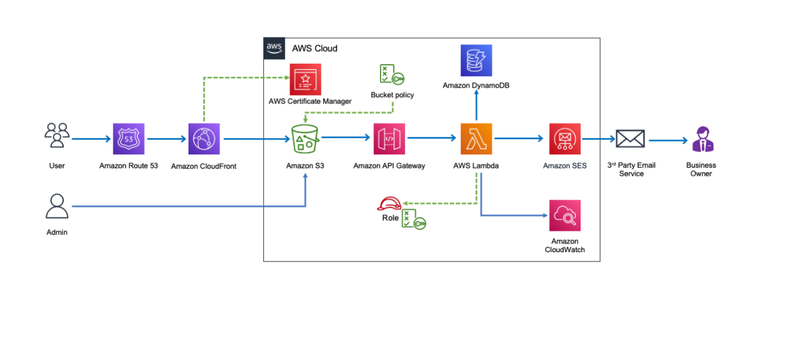

# Serverless Lead Capture on AWS

A fully serverless **lead capture & contact-us system** built on AWS using **Amazon S3, API Gateway, AWS Lambda, DynamoDB, and Amazon SES**.

This project demonstrates how to design, deploy, and operate a **scalable, secure, and cost-effective serverless web application** on AWS.

---

##  Architecture Diagram

---

##  Project Overview

The solution follows a **3-phase serverless architecture** to handle static website hosting, backend processing, and data persistence without managing any servers.

---

## 🔹 Phase 1: Static Website Hosting (Amazon S3)

###  Objective  
Host a public static website using **Amazon S3**.

### 🛠 Steps
- Created an S3 bucket
- Enabled static website hosting
- Configured bucket policy for public access
- Uploaded website files using `aws s3 sync`
- Added a custom `404.html` error page

**Result:** Website successfully accessible via the S3 website endpoint.

---

## 🔹 Phase 2: Dynamic Contact Form (API Gateway + Lambda)

###  Objective  
Process contact form submissions using a serverless backend.

### 🛠 Steps
- Created an **AWS Lambda** function
- Configured **Amazon SES** and verified email identities
- Created an **IAM role** with permissions for:
  - CloudWatch Logs
  - SES `SendEmail`
- Created a **REST API** using **Amazon API Gateway**
- Enabled **CORS** support
- Integrated API Gateway with Lambda
- Updated frontend JavaScript to send `POST` requests to the API

 **Result:** Form submissions successfully trigger Lambda execution.

---

## 🔹 Phase 3: Data Management (Amazon DynamoDB)

###  Objective  
Persist submitted contact messages.

### 🛠 Steps
- Created a DynamoDB table named **`ContactMessages`**
  - Partition key: `id` (String)
- Updated Lambda role with `dynamodb:PutItem` permission
- Enhanced Lambda function to:
  - Store lead data in DynamoDB
  - Send email notifications via SES
- Verified records using DynamoDB Explore Items
- Verified execution logs in CloudWatch

 **Result:** Leads are stored reliably and email notifications are delivered.

---

##  AWS Services Used

| Service | Purpose |
|------|------|
| Amazon S3 | Static website hosting |
| Amazon API Gateway | Backend API |
| AWS Lambda | Serverless backend logic |
| Amazon DynamoDB | Lead storage |
| Amazon SES | Email notifications |
| AWS IAM | Access control |
| Amazon CloudWatch | Logging and monitoring |

---

## 🧪 Testing & Validation

-  Tested form submission from the website
-  Verified successful API responses
-  Verified DynamoDB records
-  Verified email delivery via SES
-  Verified Lambda logs in CloudWatch

---

##  Key Learnings

- End-to-end serverless architecture design
- Secure IAM permission management
- API Gateway and Lambda integration
- DynamoDB schema design
- CORS configuration
- Real-world AWS troubleshooting

